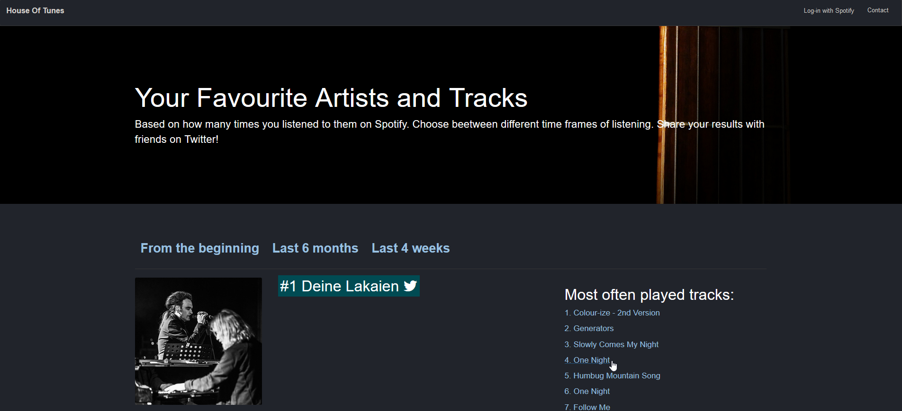
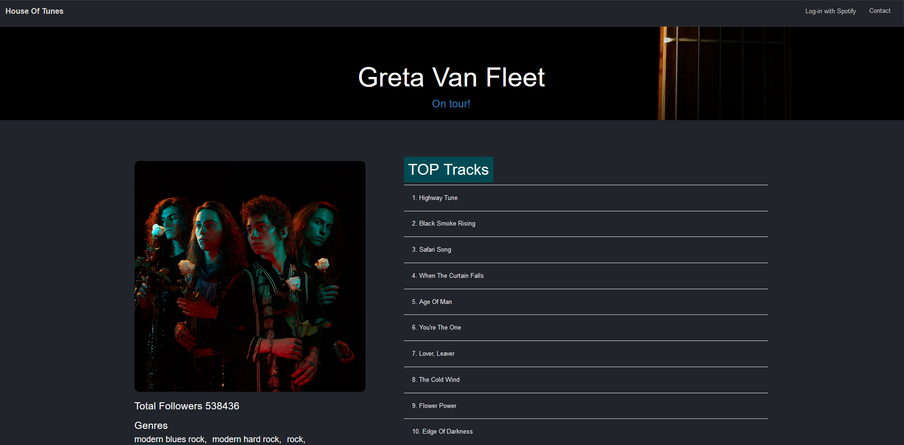
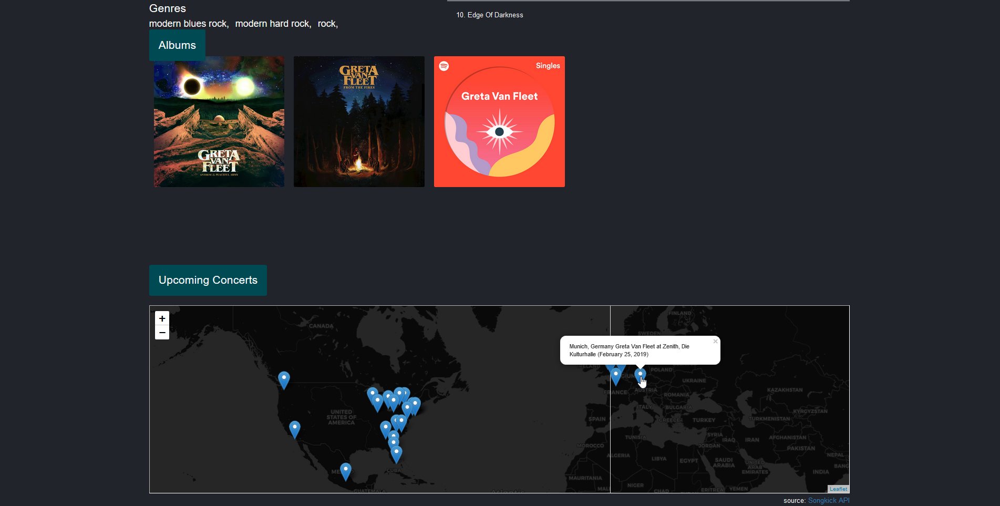
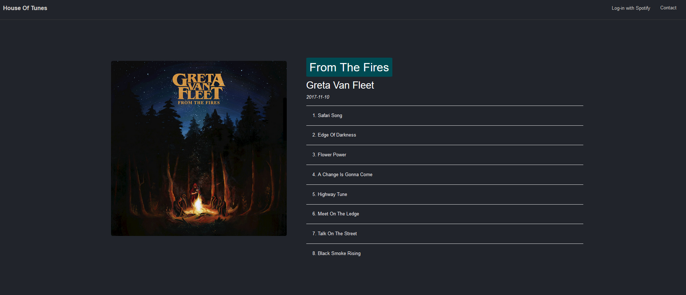

**Welcome to the _House Of Tunes_ Github repository!**

http://grzesek.pythonanywhere.com/

House Of Tunes is web application which allows user to search through their personal music statistics stored 
in Spotify API. Website was created using Python Flask micro-framework. To access data, you need to log in 
with your Spotify account. 

When you're logged-in you will see the list of your favourite artist and tracks. You can choose between time periods to see your latest favourite music or from the beginning of your Spotify account. Clicking on track will redirect you
to the information about album where the track was released. 

Clicking on artist  will redirect you to the information about artist

On the bottom of artist page you can see concert locations. This information is taken from Songkick Api. 

Clicking on album image will redirect you to the list of tracks 

